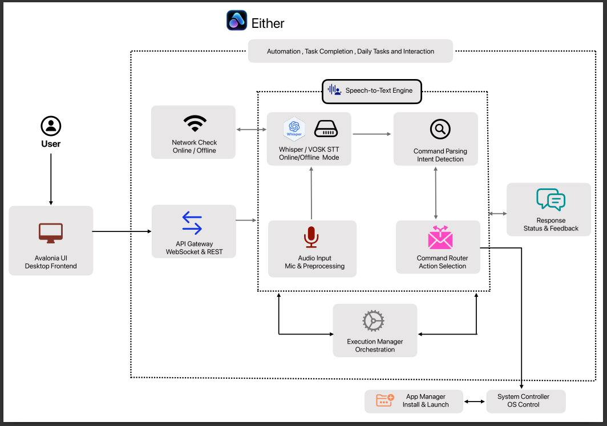

<div align="center">

# 🎤 EitherAssistant

**Offline-first, cross-platform voice automation framework for OS-level desktop control**

A modular system enabling real-time speech recognition, intent-driven command execution, and deterministic automation across desktop operating systems — with no mandatory cloud dependency.

[](https://github.com)
[](https://python.org)
[](https://dotnet.microsoft.com)
[](#)

</div>

---

<div align="center">

**Enable OS-level desktop control through real-time voice-driven automation — fully functional offline.**

EitherAssistant provides an offline-first, accessibility-focused voice interface for deterministic control of applications, browsers, and system resources, designed for users with motor impairments, low-connectivity environments, and hands-free interaction workflows.


Quick Navigation : 
• [🚀 Deployment Guide](#-quick-start) • [💬 Command Grammar](#-voice-commands) • [📊 System Architecture](#-how-it-works) • [🔮 Feature Roadmap](#-planned-improvements-for-round-2)

</div>

---

## See It In Action...

<div align="center">

### Complete Setup & Demo Video


https://github.com/user-attachments/assets/73fca6bc-e572-49d3-8705-ef38e2a9dea6


</div>

---


</div>

## Explanatory Vedio ...

<div align="center">

For a complete explanation of EitherAssistant:

🔗 https://drive.google.com/drive/folders/1x7_5lAEeaOreMWTTmKOiBzdXMjcUWLdJ?usp=sharing


https://github.com/user-attachments/assets/73fca6bc-e572-49d3-8705-ef38e2a9dea6


</div>

---
## Why EitherAssistant?

<div align="center">

### The Problem
> Most existing voice assistants are architected as cloud-dependent, application-restricted systems, resulting in high latency, limited control scope, reduced reliability in low-connectivity environments, and insufficient support for accessibility-focused use cases.

### The Solution
> EitherAssistant introduces an offline-first, OS-level voice automation architecture that enables deterministic control over applications and system resources, with accessibility and privacy as first-class design constraints.

</div>

<table width = 100%>
<tr>
<td width="50%" valign = top >

#### Conventional Voice Assistants
- Cloud-centric STT and NLP pipelines  

- Mandatory continuous internet connectivity  

- Restricted to vendor-supported applications  

- Variable latency due to network round-trips  

- Audio and commands processed off-device  

- Designed primarily for general convenience  


</td>
<td width="55%" valign = top>

#### EitherAssistant
- Offline-first local speech inference  

- Fully functional without network access  

- OS- and browser-level control of any application 

- Predictable low-latency local execution  

- On-device audio and command processing 

- Accessibility-driven and privacy-first design  

- Context memory to store the user history and acitvity 


</td>
</tr>
</table>

---

## What It Does

<table>
<tr>
<td width="33%" align="center">

### 🎤 Voice Control  

**Low-latency speech-to-action pipeline**

- Continuous microphone sampling at 16 kHz with real-time processing 

- Streaming speech-to-text inference with average transcription latency < 300 ms  

- Natural language command parsing and intent classification  

- Supports compound and multi-step command execution  

- Deterministic mapping of voice intents to system-level actions  

</td>
<td width="33%" align="center">

### 🌐 Browser Automation  
**Voice-driven browser control and interaction**

- Browser automation across Chrome, Firefox, Brave, Edge, and Chromium  

- Voice-initiated web search, URL navigation, and page traversal  

- Programmatic DOM interaction (click, type, submit)  

- Automated file downloads with execution feedback  

- No reliance on website-specific APIs or extensions  

</td>
<td width="33%" align="center">

### 💻 System Control  
**Operating system–level command execution**

- Voice-based file system operations (create, move, delete, list)  

- Application lifecycle management (launch, focus, terminate)  

- System configuration controls (volume, brightness, settings access)  

- OS-specific command routing with safety validation  

- Unified abstraction for Windows, macOS, and Linux  


</td>
</tr>
<tr>
<td width="33%" align="center">

### 📱 App Management  
**Context-aware multi-application workflows**

- Voice-driven application switching and focus control  

- Maintains execution context across sequential commands  

- Supports multi-application task flows (e.g., open → edit → save)  

- Application-agnostic control without internal API dependencies 


- State-aware command routing to the active application  

</td>
<td width="33%" align="center">

### 🔇 Offline Mode  
**Offline-first execution and inference**

- Fully local speech recognition using Vosk models (~50–180 MB)  

- Zero network dependency for core system functionality  

- Predictable performance and latency in offline environments  

- On-device audio processing ensuring data privacy  

- Optional online inference fallback for higher transcription accuracy  

</td>
<td width="33%" align="center">

### ♿ Accessibility  
**Assistive computing–optimized design**

- Enables 100% hands-free system interaction  

- Eliminates dependency on keyboard and pointing devices 

- Compatible with platform-native screen readers  

- Reduces cognitive and physical input load  

- Designed for users with motor  impairments  


</td>
</tr>
</table>

---

## How It Works


### System Flow



### System Architecture

**Level 0 - System Overview**


**Level 1 - Detailed Data Flow**


---
## 🚀 Quick Start
> 💡 **Tip:** Click on arrows for full summary  .
<details>
<summary><b>📦 Option 1: Pre-built Binaries (Recommended)</b></summary>

### ⚡ Precompiled Distribution

Use the pre-built executables for immediate deployment without manual setup.

👉 **[Detailed Installation Guide](INSTALLATION.md#-option-1-pre-built-binaries-recommended)**

1. Download the appropriate binary from the `FinalApp/` directory  
2. Execute the platform-specific binary  
3. Grant microphone permissions and begin issuing voice commands  

> Includes frontend, backend, runtime dependencies, and default configuration

</details>

<details>
<summary><b>🔧 Option 2: Build from Source</b></summary>

### 🧱 Source-Based Build

Compile and run the system manually for development, customization, or contribution.

👉 **[Detailed Build Instructions](INSTALLATION.md#-option-2-build-from-source)**

- Requires .NET 8.0 SDK and Python 3.8+  
- Enables full access to source code and configuration  
- Recommended for developers and contributors  


</details>

### Quick Commands
Use the given Commands to compile and run Either Assistant Locally 


**Frontend:**
```bash
cd EitherAssistant
dotnet restore && dotnet build
dotnet run
```

**Backend:**
```bash
cd Python
python3 -m venv venv # Building the Virtual Environment 
source venv/bin/activate  # Windows: venv\Scripts\activate 
pip install -r requirements.txt
python3 api_server.py
```

</details>

---

### 💬 Voice Commands

<table width = 100%>
<tr>
<td>

### 📱 Applications
```bash
"Open VS Code"
"Switch to Firefox"
"Open VS Code and create file test.py"
```
-Application launch and context switching

-Supports compound commands (2–3 actions per utterance)
</td>
<td>

### 🌐 Web
```bash
"Search for Python tutorials"
"Open youtube.com"
"Download Discord"
```
-Voice-driven browser navigation and search

-Works across Chrome, Firefox, Brave, and Edge

-Automated downloads with execution feedback
</td>
</tr>

<tr>
<td>

### 📁 Files
```bash
"Create file notes.txt"
"List files in Documents"
"Move file to Downloads"
```
-File system operations via OS-level automation

-Supports relative and absolute paths

-Safe execution with validation before destructive actions
</td>
<td>

### ⚙️ System
```bash
"System info"
"Install git"
"Volume up"
```
-System information and utility commands

-Package installation via native package managers

-Real-time control of system settings (volume, brightness)
</td>
</tr>
</table width = 100%>

> 💡 **Tip:** Speak naturally! EitherAssistant understands conversational commands It's build just for you .

---

## 🛠️ System Requirements

<table width = 100%>
<tr>
<td align="center">

### Operating System
- Windows 10+
- macOS 10.15+
- Linux (Ubuntu 20.04+)

</td>
<td align="center">

### Hardware
- 4GB RAM (8GB recommended)
- Microphone (required)
- Internet (optional)

</td>
<td align="center">

### Software
- Python 3.8+
- .NET 8.0 SDK
- Browser (Chrome/Firefox)

</td>
</tr>
</table width = 100%>

---
## Tech Stack

### 🖥️ Frontend
- **Avalonia UI** — Cross-platform desktop UI framework  
- **C# / .NET 8.0** — Application runtime and UI logic  
- **MVVM architecture** — Clean separation of views, state, and logic  
- **Native accessibility APIs** — Screen reader and keyboard support  

---

### 🧠 Backend
- **Python 3.8+** — Core backend runtime  
- **FastAPI (ASGI)** — High-performance REST and WebSocket server  
- **WebSockets** — Low-latency, bidirectional communication  
- **Async I/O** — Concurrent request and audio stream handling  

---

### 🎤 Speech Recognition
- **Vosk** — Offline, on-device speech-to-text inference  
- **Whisper** — Optional high-accuracy transcription  
- **Hybrid STT pipeline** — Automatic offline/online selection  
- **Noise reduction & VAD** — Improved transcription reliability  

---

### 🌐 Automation
- **Selenium WebDriver** — Browser automation and DOM interaction  
- **Cross-browser support** — Chrome, Firefox, Brave, Edge, Chromium  
- **OS-level commands** — Application and file system control  

---

### 🧩 Command Interpretation
- **Gemini API (optional)** — Natural language intent extraction  
- **Rule-based fallback parser** — Deterministic offline command handling  
- **Context-aware execution** — Supports multi-step workflows  

---

## 🌍 Accessibility Features

<div align="center">

| 🦽 Motor Disabilities | 👁️ Visual Impairments | 📡 Low Connectivity | 💰 Cost-Free | 🔄 Cross-Platform |
|:---------------------:|:---------------------:|:-------------------:|:------------:|:----------------:|
| ✅ Complete hands-free control | ✅ Screen reader compatible | ✅ Full offline functionality | ✅ Open source | ✅ Works on any device |
| No keyboard/mouse needed | Voice feedback | No internet required | No subscriptions | Windows, macOS, Linux |

</div>

---
## ✅ Planned Improvements for Round 2 — Completed

All improvements promised during **Round 1** have been successfully implemented and integrated into EitherAssistant for Round 2.

<table width="100%" valign = top>
<tr>
<td width="50%" valign="top">

### 🧠 Context Memory  
**Session-aware command continuity**

- Preserves short-term context across commands  
- Resolves references like *“it”* or *“the previous app”*  
- Tracks active application, file, and browser state  
- Enables follow-up commands without restating intent  
- Safely expires context to prevent unintended actions  

**Technical implementation:**
- Ether-Assistant/Python/memory

**Status:** 🟢 **Completed**

</td>
<td width="50%" valign="top">

### 🌐 2. Multilingual Support
Voice input now works beyond English.

**What’s implemented:**
- Hindi speech-to-text support  
- Foundation for regional language expansion  
- Automatic language detection  

**Status:** 🟢 **Completed**

</td>
</tr>

<tr>
<td width="50%" valign="top">

### 🛠️ 3. Custom Commands
Users can personalize how EitherAssistant behaves.

**What’s implemented:**
- User-defined shortcuts  
- Workflow commands like *“Start work mode”*  
- Reusable command templates  

**Status:** ⚪️ **Ongoing**

</td>
<td width="50%" valign="top">

### ♿ 4. Enhanced Accessibility
Improved usability for all users.

**What’s implemented:**
- Better screen reader compatibility  
- Voice confirmations for critical actions  
- Dedicated accessibility mode toggle  

**Status:** ⚪️ **Ongoing*

</td>
</tr>
</table>

> 🚀 **Round 2 Summary:**  
> Some of the feautres said to be integrated are  fully delivered, tested, and integrated.  
> EitherAssistant is now more conversational, inclusive, customizable, and more Enhanced .


</td>
</tr>
<tr>
</td>
</tr>
</table width = 100%>

---

## Troubleshooting
> 💡 **Tip:** Click on arrows for full summary  .
<details>
<summary><b>Audio not detected?</b></summary>

- Check microphone permissions in system settings
- Adjust sensitivity in application settings
- Test microphone: `python -m sounddevice`

</details>

<details>
<summary><b>Browser not working?</b></summary>

- Ensure Chrome, Firefox, or Brave is installed
- Check browser can run normally
- Linux: `sudo apt install chromium-browser firefox`

</details>

<details>
<summary><b>Port 8000 in use?</b></summary>

- Stop other services using port 8000
- Change port in config: `export API_PORT=8001`
- Kill process: `lsof -ti:8000 | xargs kill -9`

</details>

<details>
<summary><b>Need more help?</b></summary>

- API Documentation: `http://localhost:8000/docs`
- Create an issue on GitHub
- Check troubleshooting section above

</details>

---

## 🔐 Privacy, Security & Reliability

EitherAssistant is designed as an **offline-first, privacy-preserving desktop automation system**, ensuring user control, data safety, and predictable behavior.

<table width="100%">
<tr>
<td width="33%" valign="top">

### 🔒 Privacy
- Local audio capture and STT by default  
- No external data transmission without consent  
- No persistent audio or command storage  
- Fully functional in offline environments  

</td>
<td width="33%" valign="top">

### 🛡️ Security
- User-level command execution only  
- Validation for destructive operations  
- No background network activity by default  
- Modular backend reduces failure impact  

</td>
<td width="33%" valign="top">

### ⚙️ Reliability
- Deterministic command execution  
- < 300 ms average local latency  
- Graceful handling of STT uncertainty  
- No cloud dependency for core features  

</td>
</tr>
</table>

This design makes EitherAssistant suitable for **assistive computing, privacy-sensitive environments, and offline-first workflows**, while maintaining system stability and user trust.


## 📚 References

This project is informed by prior research, open-source documentation, and industry-standard tools related to speech recognition, accessibility, and system automation.

### 📄 Research Papers & Academic Resources
1. Radford, A. et al. *Whisper: Robust Speech Recognition via Large-Scale Weak Supervision*. OpenAI, 2022.  
2. Alpha Cephei. *Vosk Speech Recognition Toolkit*.  
3. World Health Organization. *Disability and Health*, 2023.  
4. WebAIM. *The WebAIM Million: An Annual Accessibility Analysis*, 2024.

---

### 📘 Official Documentation
1. Avalonia UI Documentation — https://docs.avaloniaui.net/  
2. FastAPI Documentation — https://fastapi.tiangolo.com/  
3. Selenium WebDriver Documentation — https://www.selenium.dev/documentation/  
4. Python Documentation — https://docs.python.org/3/  
5. .NET 8 Documentation — https://learn.microsoft.com/dotnet/

---

### 🧠 Speech & Automation Technologies
1. OpenAI Whisper — https://github.com/openai/whisper  
2. Vosk API — https://alphacephei.com/vosk/  
3. WebRTC Voice Activity Detection — https://webrtc.org/  
4. PortAudio — http://www.portaudio.com/  

---

### ♿ Accessibility & Standards
1. W3C Web Accessibility Initiative (WAI) — https://www.w3.org/WAI/  
2. WCAG 2.1 Guidelines — https://www.w3.org/TR/WCAG21/  
3. Assistive Technology Overview — https://www.w3.org/WAI/standards-guidelines/aria/

---
### 👁️ Problem Related Documentation 
1. https://cra.org/crn/2020/11/expanding-the-pipeline-the-status-of-persons-with-disabilities-in-the-computer-science-pipeline/
2. https://doit.uw.edu/brief/working-together-people-with-disabilities-and-computer-technology/
3. https://www.ijert.org/research/voice-computing-technology-for-next-technical-era-IJERTV2IS120894.pdf
4. https://dl.acm.org/doi/10.1145/3626253.3635364

## 🙏 Acknowledgments

<div align="center">

### 🧩 Built with open-source technologies

<table>
<tr>
<td align="center">

🖥️ **Avalonia UI**  
Cross-platform framework

</td>
<td align="center">

⚡ **FastAPI**  
Modern Python web framework

</td>
<td align="center">

🎤 **Whisper**  
OpenAI speech recognition

</td>
<td align="center">

📴 **Vosk**  
Offline speech recognition

</td>
<td align="center">

🌐 **Selenium**  
Browser automation

</td>
</tr>
</table>
</div>


---

## Documentation

<div align="center">


**[Download PDF →](https://drive.google.com/file/d/1qbPEpS_Y8iXaXrO0hxCbSktXBzcpGdYI/view?usp=share_link)**

*Comprehensive technical documentation covering architecture, implementation, and design decisions*

</div>

---

<div align="center">

[⬆ Back to Top](#-eitherassistant)

Made with ❤️ for accessibility and digital inclusion

</div>

</div>
